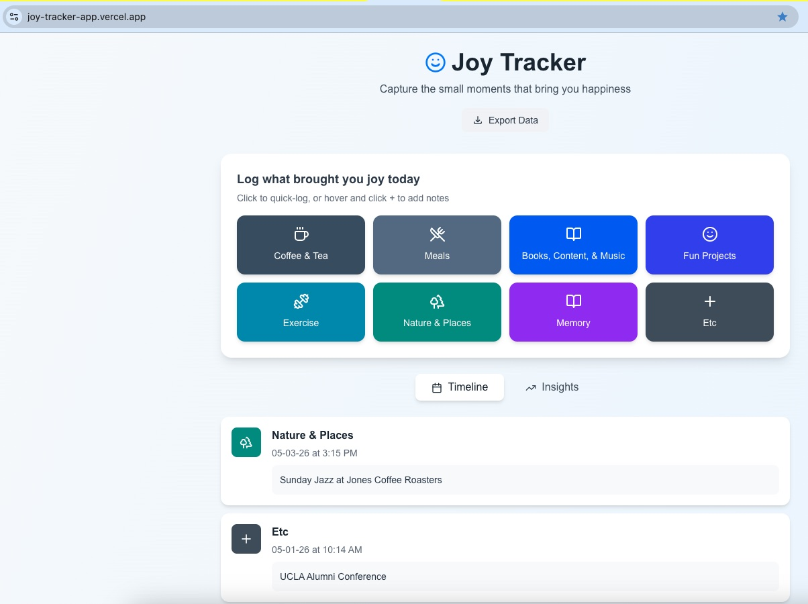

# Joy Tracker

A simple, beautiful web app for tracking daily moments of joy. Built in one conversation with Claude AI.

**[View Live Demo](https://joy-tracker-app.vercel.app//demo)** | **[Read the Tutorial](https://bessiechu.wordpress.com/2026/05/04/from-idea-to-a-deployed-app-in-one-conversation/)**



## What It Does

Track the small moments that bring you happiness - the good coffee, the nice walk, finishing a project. Joy Tracker gives you:

- **Quick logging** - One click to capture a moment
- **Flexible notes** - Add context when you want it
- **Smart insights** - See patterns across time periods
- **Your data, your way** - Export anytime, stored locally

## Features

✅ 8 customizable categories (Coffee & Tea, Meals, Books/Content/Music, Fun Projects, Exercise, Nature & Places, Memory, Etc)  
✅ Quick-log with one click or add detailed notes  
✅ Edit and delete entries anytime  
✅ Timeline view with timestamps  
✅ Insights tab with patterns and streaks  
✅ Export data (JSON download or copyable text)  
✅ Time-filtered exports (week, month, all time, custom range)  
✅ Mobile responsive design  
✅ Works offline (localStorage)  
✅ Zero cost to run  

## Tech Stack

- **Framework:** Next.js 14 (App Router)
- **Language:** TypeScript
- **Styling:** Tailwind CSS
- **Icons:** Lucide React
- **Storage:** localStorage (browser-based)
- **Hosting:** Vercel (free tier)

## Quick Start

### Option 1: Deploy Directly to Vercel (Fastest)

[](https://vercel.com/new/clone?repository-url=https://github.com/bessiec/joy-tracker-app)

Click the button, connect your GitHub, and you're live in 2 minutes.

### Option 2: Run Locally

```bash
# Clone the repo
git clone https://github.com/bessiec/joy-tracker-app
cd joy-tracker-app

# Install dependencies
npm install

# Run development server
npm run dev

# Open http://localhost:3000
```

### Option 3: Manual Deployment

1. Fork this repo
2. Connect to [Vercel](https://vercel.com)
3. Import your forked repo
4. Deploy (no configuration needed)

## Project Structure

```
joy-tracker-app/
├── app/
│   ├── page.tsx          # Main app (your tracker)
│   ├── demo/
│   │   └── page.tsx      # Interactive demo page
│   └── layout.tsx        # Root layout
├── public/               # Static assets
└── package.json          # Dependencies
```

## How It Works

### Data Storage

Uses **localStorage** - a browser feature that saves data on your device:

**Pros:**
- ✅ Private (data never leaves your browser)
- ✅ Free (no database costs)
- ✅ Fast (instant save/load)
- ✅ Works offline

**Important:**
- ⚠️ Device-specific (laptop ≠ phone)
- ⚠️ Browser-specific (Chrome ≠ Safari)
- ⚠️ Export regularly to back up

### Using the App

1. **Quick Log:** Click a category button to instantly save a moment
2. **Add Details:** Click the + icon to add notes and set custom date/time
3. **View Timeline:** See all entries chronologically
4. **Check Insights:** Switch tabs to see patterns (top sources, streaks, category breakdown)
5. **Edit/Delete:** Hover over any entry to modify it
6. **Export:** Download JSON or copy as text for Google Docs

## Customization

### Change Categories

Edit `app/page.tsx`:

```typescript
const categories: Category[] = [
  { id: 'your-id', name: 'Your Category', icon: YourIcon, color: 'bg-blue-600' },
  // ... add more
];
```

### Change Colors

Tailwind classes in each category's `color` field:
- `bg-slate-600` - Gray
- `bg-blue-600` - Blue
- `bg-purple-600` - Purple
- etc.

### Add Cloud Sync

Want to sync across devices? Add Supabase:

1. Create Supabase project
2. Add API keys to `.env.local`
3. Replace localStorage with Supabase client calls
4. See [Supabase docs](https://supabase.com/docs) for setup

## Development Timeline

**Total Time:** ~4.5 hours

- Initial build: 2 hours
- Iterations and polish: 2 hours
- Deployment and debugging: 30 minutes

**Traditional approach:** Weeks to months

## Cost Breakdown

| Item | Cost | Notes |
|------|------|-------|
| Development | $0 | Claude.ai free tier |
| Hosting | $0 | Vercel free tier (100GB bandwidth) |
| Database | $0 | localStorage (browser-based) |
| **Total** | **$0** | Completely free to build and run |

**Optional AI Features:**
- Weekly analysis: ~$0.12/month
- Daily analysis: ~$0.90/month

## Known Issues

- localStorage is device/browser-specific
- Clearing browser data deletes entries (export regularly!)
- No built-in backup (use export feature)

## Future Ideas

- [ ] Photo attachments
- [ ] Weekly email summaries
- [ ] Social sharing
- [ ] Apple Health integration
- [ ] Voice logging
- [ ] Cloud sync (Supabase)
- [ ] Mobile app (React Native)

## The Build Process

This app was built entirely through conversation with Claude AI. The full conversation history, including every prompt and iteration, is available in [`CONVERSATION.md`](CONVERSATION.md).

**Key learnings:**
- Start simple, iterate based on use
- Be specific in prompts (describe current + desired behavior)
- Test each version and report back
- Deployment isn't always one-click (but fixes are fast)

**Read the full tutorial:** [Blog post link](https://bessiechu.wordpress.com/2026/05/04/from-idea-to-a-deployed-app-in-one-conversation/)

## Contributing

This is a personal project, but feel free to:
- Fork and customize for your needs
- Open issues for bugs
- Submit PRs for improvements

## License

MIT License - feel free to use this code for your own projects.

## Acknowledgments

- Built with [Claude AI](https://claude.ai) by Anthropic
- Icons by [Lucide](https://lucide.dev)
- Hosted on [Vercel](https://vercel.com)

---

This is a [Next.js](https://nextjs.org) project bootstrapped with [`create-next-app`](https://nextjs.org/docs/app/api-reference/cli/create-next-app).

## Getting Started

First, run the development server:

```bash
npm run dev
# or
yarn dev
# or
pnpm dev
# or
bun dev
```

Open [http://localhost:3000](http://localhost:3000) with your browser to see the result.

You can start editing the page by modifying `app/page.tsx`. The page auto-updates as you edit the file.

This project uses [`next/font`](https://nextjs.org/docs/app/building-your-application/optimizing/fonts) to automatically optimize and load [Geist](https://vercel.com/font), a new font family for Vercel.

## Learn More

To learn more about Next.js, take a look at the following resources:

- [Next.js Documentation](https://nextjs.org/docs) - learn about Next.js features and API.
- [Learn Next.js](https://nextjs.org/learn) - an interactive Next.js tutorial.

You can check out [the Next.js GitHub repository](https://github.com/vercel/next.js) - your feedback and contributions are welcome!

## Deploy on Vercel

The easiest way to deploy your Next.js app is to use the [Vercel Platform](https://vercel.com/new?utm_medium=default-template&filter=next.js&utm_source=create-next-app&utm_campaign=create-next-app-readme) from the creators of Next.js.

Check out our [Next.js deployment documentation](https://nextjs.org/docs/app/building-your-application/deploying) for more details.
